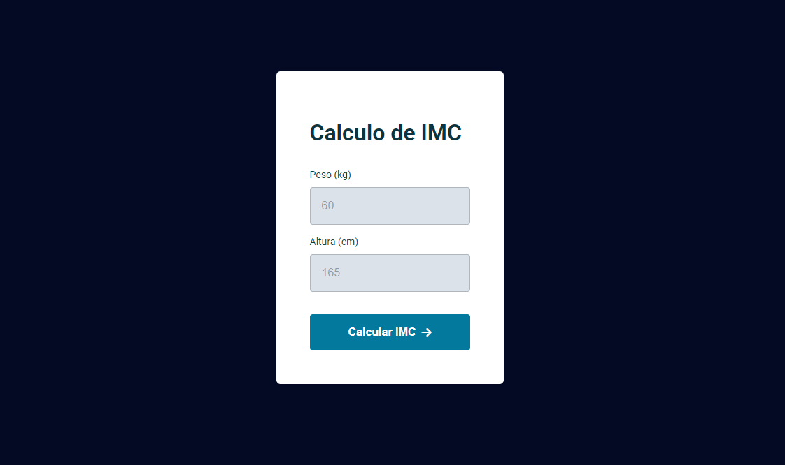

# Calculadora IMC

> Trilha Explorer

Projeto desenvolvido na quinta etapa (Avançando no JavaScript) da trilha Explorer da Rocketseat.

Neste projeto, adquiri conhecimentos sobre a criação de um modal (janela pop-up) e como torná-lo visível por meio do JavaScript. Utilizei-o para exibir resultados e classificações do Índice de Massa Corporal (IMC) na interface do usuário.

Também aprendi a criar uma caixa de alerta de erro personalizada, a modificar seu texto e a exibi-la através do JavaScript quando o usuário inserir caracteres que não sejam números ou deixar o campo de entrada vazio.

Ao estruturar os dados do projeto, utilizei uma constante contendo um objeto literal. Organizei o código de forma mais eficiente, separando-o em módulos usando o recurso ES6 modules, aprimorando assim a organização geral do projeto, entre outras habilidades adquiridas.

[🔗 Clique aqui para acessar](https://kennedysmartins.github.io/Calculadora-IMC/)

## 🛠️ Tecnologias

- HTML
- CSS
- JavaScript